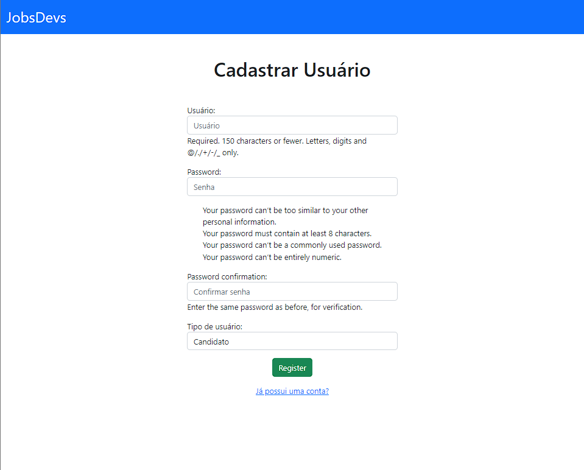
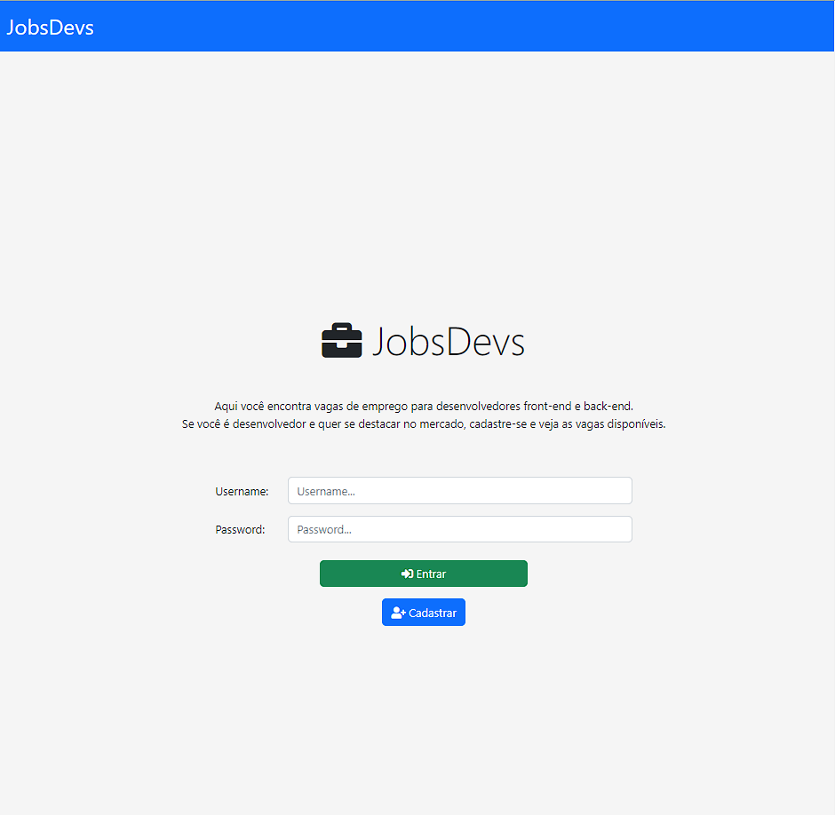
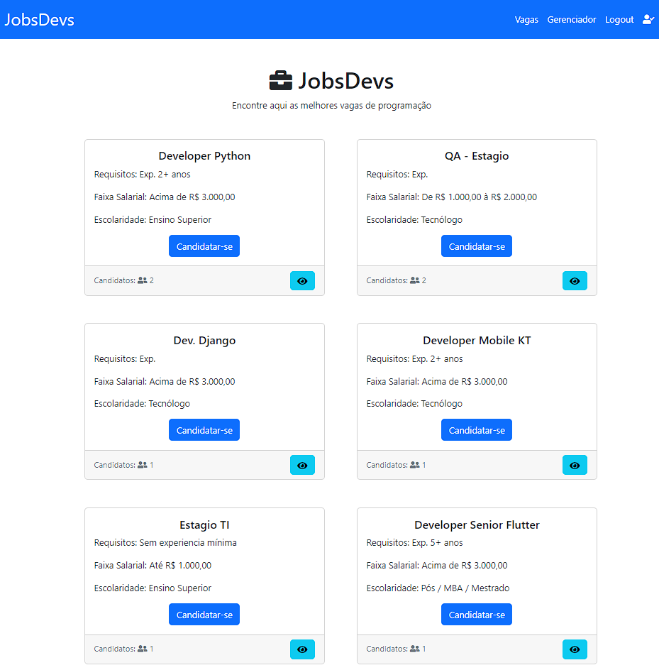
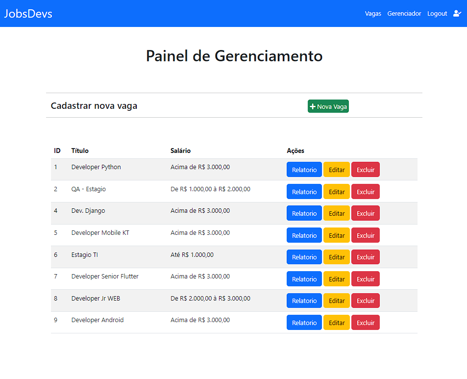
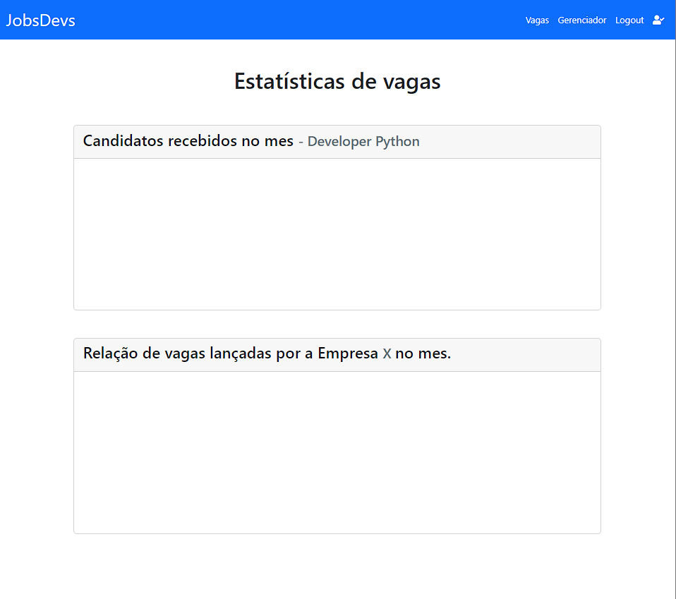

# TESTE PRATICO DE APLICAÇÃO WEB DJANGO/PYTHON
<pre>
<h4>Proposta de desenvolvimento de um aplicativo web para o Django Framework e Python no Backend.<h4>
<h3>    Ferramentas utilizadas</h3>
        Python 3.9.13
        Django 4.1
        Bootstrap 5.1
        Sqlite3 

</pre>
<pre>
<h2 align=center>Telas</h2>
Cadastro

Login

Home

Painel de controle

Estatistica da vaga

    
</pre>
